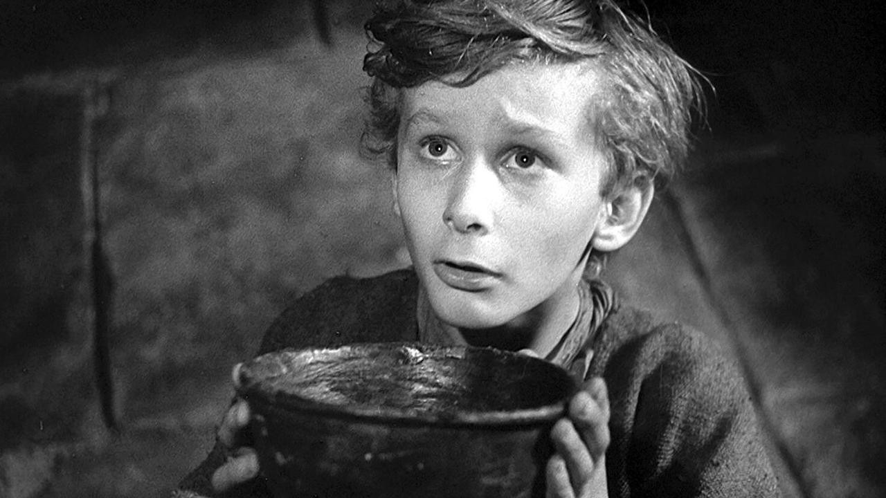

Pip All
===

Fixing pip's problems, one package at a time

Pip
---

Python package manager! Install Python modules with ease! Pin them! Upgrade
them! The world is yours!

Pip All
-------

Okay, so upgrading packages en masse isn't really a "pip thing". All you can do
is ask pip "hey, what are my outdated packages?" and pip will tell you. If you
then ask pip "please, sir, I want some updates" I mean "update all the
packages" pip responds with ~~"What!"~~ "lol, no".

Enter `pip-all`. It fills in the void in our hearts, and our bowls.

It's also written in ~~perl~~ python. What else would you expect?

BUGS
----

* None! I fixed them all!
